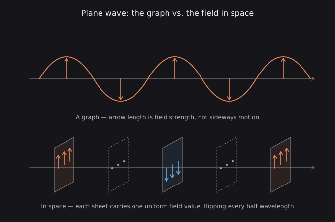
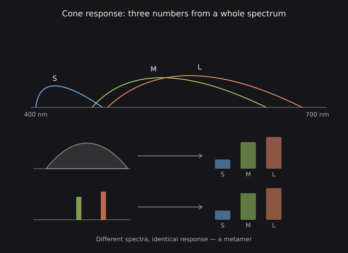

# Prequel — The Electromagnetic Field: What Light Actually Is

**Goal:** replace the wiggly-rope picture of light with the field it actually is, and see that the wave description is a Fourier basis — the same change of basis that runs through the rest of the course.

This module sits before Module 0. Radiometry defines light as a *quantity you can measure*; this defines what is being measured. If you already think of $E(\lambda)$ as a function rather than a thing, you can skip to Module 0 and lose nothing.

---

## P.1 There is no little wiggly object

Nothing flies through space wiggling. What exists is a **field**: at every point in space, at every instant, there are two vectors — an electric field $\mathbf{E}$ and a magnetic field $\mathbf{B}$. That is the whole ontology. The field is defined everywhere, always, including where it is zero.

"Radiation" is a self-sustaining disturbance in that field which propagates at $c$, because Maxwell's equations make a changing $\mathbf{E}$ produce a $\mathbf{B}$ and a changing $\mathbf{B}$ produce an $\mathbf{E}$. So yes to *permeates space* — but it is a vector field filling three dimensions, not a beam of glowing stuff travelling through an otherwise empty one.

The distinction is not pedantry. Almost every downstream confusion in this course — what a spectrum is, why three numbers suffice, why a display works at all — is easier once the field picture is in place.

---

## P.2 The picture that misleads

The textbook drawing is a **graph**. The vertical axis is field strength; the horizontal axis is position. The curve is not the shape of anything.

For an ideal plane wave the field is *identical across an entire infinite plane* perpendicular to the direction of travel. The honest mental image is alternating slabs of field sweeping past you, not a rope being shaken. Nothing moves sideways. Only the field value at each fixed point changes with time.

Watch the live version above and note what actually travels: the arrows grow, shrink and flip **in place**. The pattern propagates; the material does not. This is the same distinction as a stadium wave — the people stay in their seats.

---

## P.3 Why waves at all

This is not a modelling convention imposed from outside. Combine Maxwell's equations in vacuum and the wave equation drops out:

$$
\nabla^2 \mathbf{E} = \frac{1}{c^2}\frac{\partial^2 \mathbf{E}}{\partial t^2}
$$

Sinusoids are the natural solutions because they are the **eigenfunctions** of that equation. A pure sinusoid propagates without changing shape; an arbitrary bump generally does not stay itself. Wavelength and frequency are then just parameters labelling those solutions, locked together by $\lambda f = c$.

---

## P.4 Yes, it is a Fourier transform

The physically complete description is $\mathbf{E}(\mathbf{x}, t)$ — a field value at each point and time. The description in terms of frequencies is $\mathbf{E}(\mathbf{k}, \omega)$, its Fourier transform. **Same information, different basis, invertible either way.**

A prism, a diffraction grating, a radio tuner and your cochlea are all physical Fourier analysers: hardware that performs the decomposition.

This is the first appearance of the course's second recurring shape — a change of basis — and it will not be the last. XYZ to LMS, sRGB to linear, world space to clip space, spatial domain to frequency domain: same move, different subject.

---

## P.5 Why that basis is privileged

The Fourier basis is not one arbitrary choice among many. Three concrete reasons:

- **Maxwell's equations in vacuum are linear and translation-invariant** in space and time, which makes plane waves the modes that evolve *independently*. Decompose into wavelets or polynomials instead and the components mix as time passes. Fourier components do not.
- **In a medium, different frequencies travel at different speeds.** Frequency is the label that tracks what actually stays separate — which is dispersion, and which is why a prism works.
- **Quantum mechanically $E = \hbar\omega$**, so frequency determines photon energy: whether light ionises an atom or merely warms your skin.

---

## P.6 "Monochromatic" is always an approximation

A pure sinusoid is infinite in extent in both space and time. Real light is a **wave packet**, which necessarily contains a spread of frequencies — and the shorter the pulse, the wider the spread.

That trade-off is the Fourier uncertainty relation, and it is the same mathematics that gives $\Delta x \cdot \Delta p \ge \hbar/2$ in quantum mechanics. It is worth internalising here because it recurs in Module 5 as the time–frequency trade-off in a spectrogram window, and in Module 7 as the reason a filter cannot be simultaneously sharp in space and narrow in frequency.

---

## P.7 Do different frequencies affect each other?

**In vacuum, no — and this is a strong statement.** Maxwell's equations are exactly linear there, so superposition holds perfectly. Two beams pass through each other and emerge completely unchanged.

Interference is not an exception. When two waves cancel at a point, that is their *sum* being zero there, not the waves damaging one another. This is why you can see a star through a crossing laser beam, and why a million radio broadcasts coexist in the air around you.

Nonlinearity has to come from somewhere, and there are two places:

**Matter.** A material's polarization response is not perfectly linear:

$$
P = \chi^{(1)}E + \chi^{(2)}E^2 + \chi^{(3)}E^3 + \dots
$$

At everyday intensities the higher terms are negligible. Crank up the field and they are not. The $E^2$ term multiplies frequencies together, and multiplying sinusoids produces sums and differences — that is second-harmonic generation. A green laser pointer is really an infrared laser at 1064 nm passed through a crystal that doubles it to 532 nm. The $E^3$ term gives four-wave mixing, the Kerr effect, self-phase modulation. This is the whole field of nonlinear optics, and every bit of it is frequencies interacting *through a medium* rather than directly. Radio engineers exploit the same mechanism deliberately: a superheterodyne receiver mixes your signal with a local oscillator in a nonlinear element specifically to shift it to a convenient intermediate frequency.

**Extreme fields in vacuum.** Approaching the Schwinger limit ($\sim 10^{18}$ V/m) the vacuum itself becomes weakly nonlinear, because virtual electron–positron pairs mediate photon–photon scattering. It is an absurdly small effect, but light-by-light scattering has been observed in heavy-ion collisions. The vacuum's linearity is an excellent approximation rather than a law.

---

## P.8 Your cones do not sample — they project

Yes, vision is built from the field. But the mechanism is much lossier than "sampling" suggests, and the word is actively misleading: this is **not** sampling in the Nyquist sense of discrete point-samples.

Each cone type is a broad, heavily overlapping filter that computes a single number — the integral of the incoming spectrum weighted by its own sensitivity curve:

$$
c_i = \int S(\lambda)\,R_i(\lambda)\,d\lambda
$$

Three cone types, three integrals. **An infinite-dimensional function collapsed to three numbers.**

The consequence is **metamerism**: infinitely many distinct spectra map to the same three numbers and are therefore physically indistinguishable to you. Your screen is not reproducing the spectrum of a real lemon; it is hitting the same triple with three narrow-band emitters. Every display technology is a hack exploiting this bottleneck.

Module 1 makes this precise — the set of spectra invisible to you is the *null space* of the cone matrix, and it has infinite dimension.

---

## P.9 The ear resolves; the eye projects

Compare hearing, which really is closer to a Fourier analyser. The basilar membrane is mechanically tuned along its length, with thousands of hair cells each responding to a narrow band. That is why you hear a C-major chord as three separable notes.

Play the visual equivalent — red light plus green light — and you do not perceive a chord. You perceive **yellow**, indistinguishable from a single pure yellow wavelength.

This one contrast explains an enormous amount about why the two crafts differ. Mixing sounds leaves them separable and mixing lights does not, so the audio engineer's problem is masking and slotting while the colourist's problem is that the information was destroyed at the sensor.

---

## P.10 What else the projection discards

- **Phase.** Cones respond to absorbed photon count over tens of milliseconds, so the $\sim 10^{14}$ Hz oscillation is utterly invisible.
- **Polarization**, barring the faint Haidinger's brush effect.
- **Everything outside roughly 380–700 nm** — about one octave out of the sixty-odd the spectrum spans.

Vision is not a recording of the field. It is a three-number summary of a one-octave slice, integrated over time, with phase and polarization thrown away.

---

## P.11 And then a second change of basis

The retina does not ship those three numbers onward as they are. It immediately recodes them into **opponent channels** of roughly $L-M$ (red–green), $S-(L+M)$ (blue–yellow), and $L+M$ (luminance).

Which is why you can imagine a reddish yellow but not a reddish green: they are opposite ends of one axis, not free dimensions. Module 4 builds perceptual colour spaces on exactly these axes, and Module 1.6 does the transform properly.

---

## Exercises

**P.1** Write down what is oscillating in a radio wave, in one sentence, without using the words "wave" or "wiggle".

**P.2** Take the plane-wave figure and mark a single fixed point in space. Describe what happens *at that point* over one period. Confirm nothing about your description involves sideways motion.

**P.3** Show that a sinusoid is an eigenfunction of $\partial^2/\partial x^2$. Then show that a Gaussian is not, and say what that implies about a pulse propagating in a dispersive medium.

**P.4** Estimate the frequency spread of a 10 fs laser pulse. Compare it to the width of the visible band and decide whether "monochromatic" is defensible for that pulse.

**P.5** Two lasers cross in vacuum. Predict what a detector past the intersection sees, and then predict what changes when you put a crystal at the crossing point.

**P.6** Construct two different spectra by hand — one broad, one two narrow spikes — and compute their cone responses against any reasonable $S$, $M$, $L$ curves. Tune the spikes until the triples match. You have built a metamer, which Module 1 will then show you how to build systematically.

**P.7** The visible band is about one octave. Work out how many octaves lie between a 60 Hz power line and a gamma ray, and reflect on how much of the field you are not equipped to see.

---

## Checkpoint

- What exists at a point in empty space where light is passing?
- Why is the sine curve in a textbook a graph rather than a picture?
- Why are sinusoids the natural solutions rather than a convenient choice?
- Two beams cross in vacuum. What happens, and why does it change inside a crystal?
- Why is "your cones sample the spectrum" the wrong verb?
- Why can you imagine reddish yellow but not reddish green?

---

→ [Module 0: Radiometry](00-radiometry.md)
