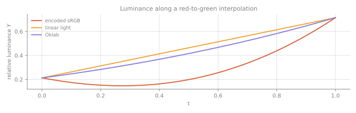

# Module 3 — Additive and Subtractive: Two Different Algebras

**Goal:** understand that "mixing color" names two unrelated operations — addition in a vector space, and multiplication of functions — and that most rendering bugs come from doing one in the wrong space.

---

## 3.1 The claim

- **Additive mixing** is **vector addition** in linear light. Two lights hitting the same spot.
- **Subtractive mixing** is **pointwise multiplication of spectra**. Light passing through, or reflecting off, successive filters.

These are different operations in different algebraic structures. "Blue + yellow = green" is true in one and false in the other, and generations of art-class confusion follow from not saying which.

---

## 3.2 Additive: a vector space, but only in linear light

Photons don't interact. Two beams superimpose:

$$\Phi_{total}(\lambda) = \Phi_1(\lambda) + \Phi_2(\lambda)$$

Because $T$ is linear (Module 1.2), this survives the projection:

$$T[\Phi_1 + \Phi_2] = T[\Phi_1] + T[\Phi_2]$$

So in XYZ, or in **linear** RGB, addition is literally vector addition. Interpolation is a convex combination. Everything behaves.

### The failure mode

Gamma-encoded sRGB is **not** a vector space for light. If $s = \text{OETF}(L)$ with $\text{OETF}$ nonlinear, then

$$\text{OETF}(L_1 + L_2) \ne \text{OETF}(L_1) + \text{OETF}(L_2)$$

Adding, averaging, or lerping in encoded sRGB computes something with no physical or perceptual meaning. It is not "approximately right." It is a category error that happens to look plausible for near-neutral colors.

**Symptoms you have already seen:**

- **The dark band.** Interpolating encoded red $(1,0,0)$ to encoded green $(0,1,0)$ passes through $(0.5,0.5,0)$, which decodes to about $(0.21, 0.21, 0)$ linear — luminance ~0.20 versus ~0.21 at red and ~0.72 at green. A muddy dark trough in the middle of your gradient.


Top bar is encoded sRGB — note the brown sag through the middle. Middle is linear light, brighter but still lumpy. Bottom is Oklab. Same two endpoints in all three.



The luminance plot is the same data without the distraction of hue: encoded sRGB dips below both endpoints, which is not something any physical mixture of two lights can do.
- **Halos on alpha composites.** Bright text on a dark background composited in encoded space produces dark fringes; the reverse produces light ones.
- **Wrong mipmaps.** Averaging encoded texels darkens minified textures. Fine checkerboards visibly dim in the distance. This is the classic "why does my grass get darker far away" bug.
- **Bad blur and DOF.** Gaussian blur is a weighted average. In encoded space, bright highlights lose energy — bokeh looks flat instead of blooming.
- **Broken lighting.** Two lights at 0.5 intensity should equal one at 1.0. In encoded space they don't.

### The rule

$$\boxed{\text{Decode} \rightarrow \text{operate} \rightarrow \text{encode}}$$

In GL, mostly free:

```glsl
// Texture: request sRGB internal format; hardware decodes on sample.
glTexImage2D(GL_TEXTURE_2D, 0, GL_SRGB8_ALPHA8, ...);

// Framebuffer: hardware encodes on write, and blending happens in linear.
glEnable(GL_FRAMEBUFFER_SRGB);
```

Both are hardware paths and both are *filter-correct* — the texture unit decodes before bilinear filtering, which manual `pow()` in the shader cannot fix. If you must do it manually, use the exact piecewise curve, not `pow(x, 2.2)`:

```glsl
vec3 srgb_to_linear(vec3 c) {
    return mix(c / 12.92,
               pow((c + 0.055) / 1.055, vec3(2.4)),
               step(vec3(0.04045), c));
}

vec3 linear_to_srgb(vec3 c) {
    return mix(c * 12.92,
               1.055 * pow(c, vec3(1.0/2.4)) - 0.055,
               step(vec3(0.0031308), c));
}
```

The piecewise form and `pow(x, 2.2)` differ by up to ~0.02 in the shadows — small in absolute terms, large relative to a code value at the bottom of an 8-bit ramp.

### The one legitimate exception

**Alpha for coverage.** When alpha represents *geometric coverage* rather than transparency, the compositing weights are areas, and areas are linear in the image plane regardless of encoding — but the *colors* being weighted must still be linear. Also: premultiplied alpha must be premultiplied in linear light. If your compositor premultiplies encoded values, edges will be wrong.

---

## 3.3 Subtractive: a multiplicative algebra

A filter has a **transmittance** $T(\lambda) \in [0,1]$. Light passing through:

$$\Phi_{out}(\lambda) = \Phi_{in}(\lambda) \cdot T(\lambda)$$

Two filters in series:

$$\Phi_{out}(\lambda) = \Phi_{in}(\lambda)\, T_1(\lambda)\, T_2(\lambda)$$

**Multiplication, not addition.** And crucially, this happens *before* the projection $T$:

$$T[\Phi \cdot T_1 \cdot T_2] \ne T[\Phi\cdot T_1] \odot T[\Phi \cdot T_2]$$

The projection does not commute with multiplication. You cannot correctly compute subtractive mixing from RGB triples. **You need the spectra.** This is the deep reason "multiply blend mode" is only a rough approximation of pigment, and why digital painting apps that want real pigment behavior (Rebelle, some Procreate features) run spectral models under the hood.

### Beer–Lambert

For an absorbing medium of thickness $d$ and absorption coefficient $\alpha(\lambda)$:

$$T(\lambda) = e^{-\alpha(\lambda)\,d} \qquad\Longrightarrow\qquad \Phi_{out}(\lambda) = \Phi_{in}(\lambda)\,e^{-\alpha(\lambda) d}$$

Exponential in depth. Consequences:

- Doubling thickness **squares** transmittance. Two sheets of the same gel are the square, not half.
- Absorption is linear in the exponent, so $\alpha$ values add for mixed absorbers — this is why optical density (log scale) is the natural unit for filters and film.
- Colored glass, water, wine, subsurface scattering, and volumetric fog all run on this. In a shader it is `exp(-sigma_a * dist)`, and the fact that `sigma_a` is a `vec3` rather than a spectrum is precisely the RGB approximation.

**Why deep water is blue-green:** $\alpha$ for water is small in the blue-green and much larger in the red. Over meters of path length, the exponential crushes red to nothing. It's not reflected sky.

### CMYK is not "RGB inverted"

Cyan ink absorbs red: $T_C(\lambda)$ is high in green/blue, low in red. Magenta absorbs green, yellow absorbs blue. So each subtractive primary *removes* one additive primary.

The naive conversion $C = 1-R$, $M = 1-G$, $Y = 1-B$ assumes ideal block-shaped filters. Real inks are not ideal:
- Cyan ink transmits some red.
- Overprinting C+M+Y gives a muddy brown, not black — hence the **K** channel.
- The relationship between ink coverage and reflectance is nonlinear (**dot gain**: ink spreads on paper).

Real CMYK conversion uses measured **ICC profiles** — lookup tables built from printing and measuring thousands of patches. There is no formula. If you ever need to do this properly, use a color management library (LittleCMS), not arithmetic.

---

## 3.4 Reflectance: the same multiplication

An object's color is:

$$\Phi_{reflected}(\lambda) = \Phi_{illuminant}(\lambda) \cdot R(\lambda)$$

$R(\lambda) \in [0,1]$ is the spectral reflectance. **This is why "the color of an object" is ill-posed** — an object has a reflectance function; a *color* only exists once you specify an illuminant and an observer.

And it explains illuminant metameric failure precisely: two objects with $R_1 \ne R_2$ can satisfy $T[\Phi_A R_1] = T[\Phi_A R_2]$ while $T[\Phi_B R_1] \ne T[\Phi_B R_2]$, because multiplying by a different illuminant rotates the difference $R_1 - R_2$ out of the null space.

**Albedo constraint for renderers.** Physically plausible diffuse albedo is roughly bounded: fresh snow ~0.9, white paint ~0.8, most natural materials 0.05–0.5, charcoal ~0.04. Albedo of 1.0 is unphysical, and albedo of 0.0 is too. Clamping author-supplied albedo to roughly [0.03, 0.9] prevents energy explosions in bounce lighting.

---

## 3.5 Kubelka–Munk: when pigment isn't just absorption

Paint isn't a filter. Light enters, scatters off pigment particles, and re-emerges — so pigment mixing involves both **absorption** $K$ and **scattering** $S$.

For an optically thick layer, the Kubelka–Munk relation between reflectance and the K/S ratio:

$$\frac{K(\lambda)}{S(\lambda)} = \frac{(1 - R_\infty(\lambda))^2}{2R_\infty(\lambda)}$$

and inverting:

$$R_\infty = 1 + \frac{K}{S} - \sqrt{\left(\frac{K}{S}\right)^2 + 2\frac{K}{S}}$$

**Mixing pigments mixes $K$ and $S$ linearly by concentration**, then converts back to reflectance:

$$K_{mix} = \sum_i c_i K_i, \qquad S_{mix} = \sum_i c_i S_i$$

So the correct pigment-mixing pipeline is: reflectance → K/S → linear blend → back to reflectance → project to RGB. Nonlinear in reflectance, linear in the K/S domain.

This is why blue and yellow paint make green (both scatter broadly, absorb complementary ends, and the surviving overlap is green) while blue and yellow *light* make white. Same words, different algebra.

---

## 3.6 The exercise that fixes your intuition

Compute cyan + yellow three ways, and put the results side by side.

```python
# 1. Naive: multiply sRGB-ENCODED values (what "multiply blend" does)
c_enc = np.array([0.0, 1.0, 1.0])
y_enc = np.array([1.0, 1.0, 0.0])
naive = c_enc * y_enc                 # -> [0, 1, 0], neon green

# 2. Multiply in LINEAR light
c_lin, y_lin = srgb_to_linear(c_enc), srgb_to_linear(y_enc)
linear_mult = linear_to_srgb(c_lin * y_lin)

# 3. SPECTRAL: multiply actual measured transmittances, then project
#    (use real cyan/yellow ink transmittance curves, 81 samples)
spd_out = D65 * T_cyan * T_yellow     # elementwise, (81,)
XYZ = spd_out @ cmfs * 5.0
spectral = linear_to_srgb(XYZ_to_sRGB @ (XYZ / norm))
```

Result 3 is a believable printed green. Result 1 is a neon that no ink can produce. Result 2 sits between and is wrong in a different way. Render all three as swatches. That image belongs in your trainer.

---

## Exercises

**3.1** **The gradient triptych.** Interpolate red→green three ways: encoded sRGB, linear light, and (preview of Module 4) Oklab. Render as three stacked bars. Plot the luminance $Y$ along each. Confirm the dark trough in the first.

**3.2** **Mipmap demonstration.** Generate a 1024×1024 black/white checkerboard. Build a mip chain by naive averaging of encoded values, and again by decode→average→encode. Display both minified. Measure mean luminance at each level; the correct chain holds 0.5, the naive one sinks.

**3.3** Implement Beer–Lambert with real water absorption coefficients. Render a depth ramp from 0 to 30 m. Confirm the blue-green shift and find the depth at which red drops below 1% transmittance.

**3.4** Implement `srgb_to_linear` both piecewise-exactly and as `pow(x, 2.2)`. Plot the difference across [0,1]. Express the maximum error in 8-bit code values. Then decide, with evidence, whether you care.

**3.5** Take measured transmittance spectra for process cyan, magenta, and yellow ink. Compute all 8 overprint combinations spectrally under D65. Render the resulting swatch set and compare to the naive $1-x$ model. Observe that C+M+Y is brown.

**3.6** Implement Kubelka–Munk mixing. Using K/S data for two pigments (ultramarine and cadmium yellow are well-documented), render a 10-step mixing ramp. Compare against naive linear RGB blending of the endpoint colors.

**3.7** Build a compositing test: white text on black and black text on white, antialiased, composited in encoded vs linear space. Zoom in on the edges. Name the artifact you see in each.

---

## Checkpoint

- Why is `mix()` on sRGB values in a shader usually wrong?
- Why can't subtractive mixing be computed from RGB triples?
- Why does two sheets of the same gel not equal half the transmittance?
- Why does CMYK need a K channel?
- Why does blue + yellow give green in paint but white in light?

← [Module 2: Colorimetry](02-colorimetry.md) | → [Module 4: Color Organization](04-color-organization.md)
