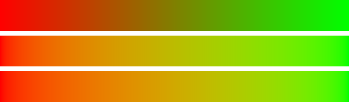
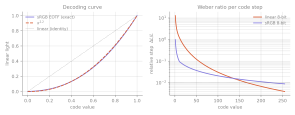

# Module 8 — The Web Deliverable: Making It Sell

**Goal:** ship a commercial page where every export decision is one you can defend from Modules 3, 4 and 5 — and where the craft is spent on clarity rather than on decoration that costs load time.

---

## 8.1 The uncomfortable premise

Visual polish is not the main driver of conversion. Clarity, speed and proof are. A beautiful page that renders in four seconds and buries the offer loses to a plain one that renders in one and says what it does.

This is not an argument against craft. It is an argument about **what the craft is for**: aesthetics make a *clear* page trustworthy. They do not make an unclear page clear. If you cannot state the offer in one sentence, no grade will save it.

The practical consequence is that two of the numbers in this module — Largest Contentful Paint and contrast ratio — are design constraints in exactly the sense that a column grid is. They are not something QA checks afterwards.

---

## 8.2 The style bible comes first

One page, written before any asset exists, referenced by every generation prompt and every export:

- **Palette** as tokens, defined in Oklch (Module 4). Ground, field, ink, accent, highlight.
- **Type**: two families maximum, three weights, one modular scale ratio.
- **Motion language**: one easing curve, one duration band, one rule about what is allowed to move.
- **Photographic treatment**: the grade that will unify everything (§8.5).
- **Three references**, each with one sentence on what specifically you are taking from it.

Without this, generative tools produce a pile of unrelated good-looking things. That is the characteristic failure mode of an AI-assisted pipeline, and it is expensive to discover at composite time.

---

## 8.3 The system before the pixels

Build the grid first. A frame per breakpoint — 1440, 768, 375 — with the column grid visible, and auto-layout stacks for anything that repeats.

Put every edge on a column. This is Müller-Brockmann's argument and it is also a practical one: a layout expressed as a system survives a content change, and a layout drawn by eye does not.

The test: state your column count and type scale ratio out loud. If you cannot, you have a drawing rather than a system.

---

## 8.4 Generate elements, not shots

The rule that matters most when using generative tools commercially.

| You want | Generate | Then |
|---|---|---|
| Hero imagery | Backgrounds, textures, atmospheric layers *separately* | Composite and grade yourself |
| Product | Art-direct a still first | Image-to-video only if it must move |
| Brand motion | Write it as a shader (Module 7) | Parameterise, sweep, select |
| Icons, diagrams | By hand, in vector | Consistency beats novelty here |

**Batch wide, select narrow.** Generate thirty to fifty candidates and keep three. Log every selection — those choices are the only training data your own taste produces, and after a few projects they describe your defaults back to you with uncomfortable accuracy.

Use a language model for **coverage, not judgement**: *"list what a client would flag about hierarchy, contrast and rhythm."* Never *"which of these is best."* Model taste regresses to the mean; that is the whole reason the perceptual half of this work is the half that stays yours.

---

## 8.5 The grade is what unifies

Generated elements arrive from different latent neighbourhoods and look it. One grade applied across all of them — lift, gamma, gain, and a single hue push — is what makes them read as one photograph rather than as a collage.

This is the highest-leverage step in the pipeline and the one most often skipped. Do it in linear light (Module 3), or the midtones will sag exactly the way the encoded interpolation does:



The top bar is what happens when you blend in the wrong space. The same trough appears in a cross-dissolve, an alpha composite, and a mipmap, for the same reason.

---

## 8.6 Export format is a colour-science decision

| Content | Format | Why |
|---|---|---|
| Photographic | AVIF, WebP fallback | 30–50% smaller than JPEG at equal quality |
| Flat, vector, UI | SVG | Scale-free, tiny, text stays selectable text |
| Screenshots containing text | Lossless WebP or PNG | **Never JPEG** — DCT ringing wrecks glyph edges |
| Gradients | CSS, not a bitmap | See below |
| Video | MP4/H.264 for reach, WebM/VP9 for size | Always ship a poster frame |

**The gradient trap.** A full-bleed hero gradient exported as an 8-bit image will band on any decent monitor. This is Module 5 arriving in commercial clothing: a smooth ramp across 1400 px has far more distinct values than 256 codes can carry.



Two fixes, both correct. Ship the gradient as CSS so the browser dithers it, or add roughly 1% noise over the bitmap — that *is* dither, and it trades a visible edge for invisible grain.

**And interpolate in the right space.** CSS now takes an interpolation hint:

```css
/* the dead grey-brown trough from §8.5 */
background: linear-gradient(90deg, #e11d48, #10b981);

/* no trough */
background: linear-gradient(in oklch, #e11d48, #10b981);
```

One keyword. The mechanism is Module 3's, and the fix is free.

---

## 8.7 Budgets, enforced rather than aspired to

Set these before building and check them on every deploy.

| Budget | Target |
|---|---|
| Largest Contentful Paint | < 2.5 s |
| Cumulative Layout Shift | < 0.1 |
| Interaction to Next Paint | < 200 ms |
| Hero image | ≤ 200 KB, everything below the fold lazy |
| JavaScript | < 100 KB compressed, for a marketing page |
| Fonts | subset, `font-display: swap`, two files maximum |
| Contrast | 4.5:1 body, 3:1 large — measured, not eyeballed |

CLS is worth dwelling on because it is a *perceptual* failure, not merely a metric: a page that reflows after paint forces the reader to re-acquire the whole layout, discarding the fixation sequence you designed. Reserve dimensions for every image and every embed.

Accessibility belongs here rather than in a compliance appendix. Contrast ratios, motion sensitivity and caption legibility are the same science as the rest of this course, and designing to them improves the default rather than constraining it.

---

## 8.8 Motion that entrains

Beat perception recruits the motor system even when you are sitting still, and moderate regularity is what makes motion feel intentional rather than decorative. Practically:

- **Ease out** for anything entering. Nothing physical starts at full speed, which is why linear reads as mechanical (Module 7).
- **One duration band** — say 150–300 ms for UI, 600–900 ms for narrative reveals. Two bands is a system; five is noise.
- **Honour `prefers-reduced-motion`.** Not as a fallback: the page must be complete with motion off, because for some readers motion is a vestibular trigger rather than a flourish.

---

## 8.9 Provenance

Boring, and increasingly the difference between usable and unusable work. Keep a per-project ledger: which assets are generated, by which model, under which licence. Check indemnification requirements **at project start**, not at delivery — the classes of model that offer it are a small subset, and discovering that late invalidates the work rather than the paperwork.

---

## 8.10 The loop that closes

Everything above makes the page good. Only measurement tells you it sells.

Instrument the thing: scroll depth, click-through on the primary action, and the conversion itself. This is the one feedback signal a trained eye cannot supply, because taste is a model of how work *reads*, not of what a stranger with a credit card does next. Run the loop the same way as the rest of this course — ship, measure, name the mechanism that failed, then pull the module that explains it.

---

## Exercises

**8.1** Take a two-hue hero gradient and render it three ways: an 8-bit PNG, a CSS gradient in sRGB, and a CSS gradient with `in oklch`. Screenshot each at 1:1 and find the banding and the trough. Then measure the file sizes.

**8.2** Build the same landing section twice, once from a column grid and once by eye. Change every string to text 40% longer. Note which one survives.

**8.3** Take five generated images from different prompts. Apply one grade to all five. Show the before and after to someone and ask which set came from one source.

**8.4** Export one photograph as JPEG, WebP, and AVIF at visually matched quality. Record the sizes. Then do the same for a screenshot containing 12 px text and describe what JPEG does to the glyph edges.

**8.5** Measure LCP on your own page over a throttled connection. Identify the LCP element. If it is a hero image, cut its bytes in half and measure again.

**8.6** Audit a page you admire against §8.7. Report which budgets it misses, then decide whether it matters — the point is calibration, not condemnation.

**8.7** Write the style bible for a project you have already finished. Note every decision you made twice because it was never written down.

---

## Checkpoint

- Why is a hero gradient shipped as an 8-bit PNG a colour-science bug rather than a taste one?
- What does `in oklch` change about a two-hue gradient, and which module explains it?
- Why is JPEG the wrong format for a screenshot with text?
- Why is Cumulative Layout Shift a perceptual failure and not just a metric?
- Why should a language model never be the selector among generated candidates?
- What is the one signal in this pipeline that your trained eye cannot supply?

---

← [Module 7: Shaders](07-shaders.md)
